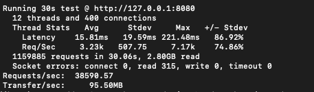

# Необходимо разработать демонстрационный сервис с простейшим интерфейсом, отображающий данные о заказе.
Модель данных в формате JSON прилагается к заданию.

Что нужно сделать:

- Развернуть локально PostgreSQL
- Создать свою БД
- Настроить своего пользователя
- Создать таблицы для хранения полученных данных
- Разработать сервис
- Реализовать подключение и подписку на канал в nats-streaming
- Полученные данные записывать в БД
- Реализовать кэширование полученных данных в сервисе (сохранять in memory)
В случае падения сервиса необходимо восстанавливать кэш из БД
-Запустить http-сервер и выдавать данные по id из кэша
- Разработать простейший интерфейс отображения полученных данных по id заказа

Советы				

- Данные статичны, исходя из этого подумайте насчет модели хранения в кэше и в PostgreSQL. Модель в файле model.json
- Подумайте как избежать проблем, связанных с тем, что в канал могут закинуть что-угодно
- Чтобы проверить работает ли подписка онлайн, сделайте себе отдельный скрипт, для публикации данных в канал
 - Подумайте как не терять данные в случае ошибок или проблем с сервисом
Nats-streaming разверните локально (не путать с Nats)
				
		
